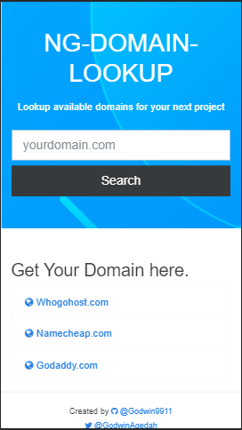

# NG-DOMAIN-LOOKUP

This project looks up available domains on the internet

## What I learnt/did

* Used Promises to resolve HTTP requests.
* Used Nodejs Built In DNS lookup.
* How to deploy fullstack angular app on heroku.
  * writing heroku specific build script.

## Screenshots
### Desktop

### Mobile

## Side Info

First Angular app deployed to heroku.